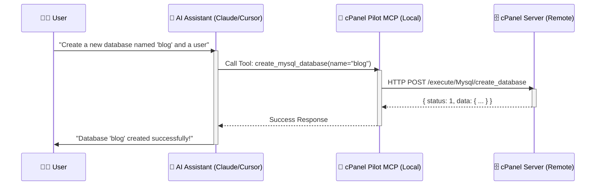

<div align="center">
  


# 🚀 cPanel Pilot MCP
**The Ultimate AI Bridge for Web Hosting Management**

[](LICENSE)
[](#)
[](https://github.com/rayss868)
[](#)
[](#)

*Empower your AI assistants (like Claude & ChatGPT) to manage, deploy, and secure your cPanel servers entirely through natural language.*

</div>

---

<br/>

## 🎯 What is cPanel Pilot?

**cPanel Pilot MCP** is a powerful, comprehensive [Model Context Protocol (MCP)](https://modelcontextprotocol.io) server engineered for managing cPanel hosting accounts seamlessly. It bridges your AI directly to cPanel's native UAPI and API2 interfaces.

Stop clicking through endless menus. Just tell your AI:  
> *"Create a new WordPress database, generate a secure password for the user, and assign full privileges."*  
...and watch it happen instantly.

<br/>

## 🏗️ How It Works (Architecture Flow)



<br/>

## ✨ Core Capabilities (164+ Tools)

cPanel Pilot gives your AI unprecedented control over your hosting infrastructure. 

### 📁 File & Storage Management
| Feature | Description |
| :--- | :--- |
| **Operations** | List, create, read, edit, and delete files inside your hosting account. |
| **Uploads** | Upload single files, multiple files to different destinations, or entire local directories directly to cPanel via MCP. |
| **Archives** | Extract `.zip` and `.tar.gz` archives directly on the server. |
| **Security** | Change CHMOD permissions easily for security and execution. |
| **Metrics** | Check account quota, consumption, and storage limits. |

### 🗄️ Database Mastery
| Feature | Description |
| :--- | :--- |
| **Engines** | Full CRUD support for **MySQL** & **PostgreSQL** databases and users. |
| **Access** | Grant or revoke fine-grained privileges per database. |
| **Remote** | Whitelist/remove IPs and hostnames for remote database connections. |

### ✉️ Next-Gen Email Management
| Feature | Description |
| :--- | :--- |
| **Mailboxes** | Create, delete, manage passwords, set quotas, and monitor disk usage. |
| **Routing** | Configure forwarders, autoresponders, and mail domain routing. |
| **Auth** | Validate, enable, and install **DKIM, SPF, and PTR** records. |
| **Spam** | Control SpamAssassin, email filters, spam box clearing, and Greylisting. |
| **Tracking** | Search email delivery logs by recipient, sender, or success status. |

### 🌐 Domains & DNS Architecture
| Feature | Description |
| :--- | :--- |
| **Domains** | Full control over Addon domains, Subdomains, Parked domains, and Redirects. |
| **DNS Editor**| View, add, edit, and delete DNS records (A, CNAME, MX, TXT, SRV). |
| **DNSSEC** | Enable DNSSEC, fetch DS records for registrars, and toggle NSEC3. |

### 🔒 Uncompromising Security
| Feature | Description |
| :--- | :--- |
| **WAF** | Check installation status and toggle **ModSecurity** globally or per-domain. |
| **Access** | IP Blocker, SSH Key management (import, authorize, delete). |
| **Authentication**| Generate secrets, enable via QR/Code verification, and disable **2FA**. |
| **Scanner** | Run **ClamAV** Virus Scans (including quarantine/disinfect). |

### ⚡ Performance & Server Operations
| Feature | Description |
| :--- | :--- |
| **PHP Environment**| Assign PHP versions per-domain, and tweak `php.ini` directives. |
| **SSL/TLS** | Install certificates, generate CSRs, and force AutoSSL renewals. |
| **Automation** | Fully manage **Cron Jobs** and configure notification emails. |

### 📦 Applications & Deployment
| Feature | Description |
| :--- | :--- |
| **Backups** | Trigger full/partial account backups and restore DBs/files on the fly. |
| **Modern Apps** | Manage **Node.js, Python, and Ruby** applications via Phusion Passenger. |
| **Git & WP** | Deploy via `.cpanel.yml`, manage Git repos natively, and list WP installs. |

<br/>

## 🛠️ Quick Start Guide

### Option 1: Run via npx (Easiest)

You can run the server directly without installing it globally using `npx`:

```json
{
  "mcpServers": {
    "cpanel-pilot": {
      "command": "npx",
      "args": ["-y", "cpanel-pilot-mcp"],
      "env": {
        "CPANEL_USERNAME": "your_cpanel_username",
        "CPANEL_API_TOKEN": "your_cpanel_api_token",
        "CPANEL_SERVER_URL": "https://your-domain.com:2083",
        "CPANEL_AUTH_MODE": "auto"
      }
    }
  }
}
```

### Option 2: Install via npm

If you prefer to install it globally on your machine:

```bash
npm install -g cpanel-pilot-mcp
```

Then configure your MCP client like this:

```json
{
  "mcpServers": {
    "cpanel-pilot": {
      "command": "cpanel-pilot-mcp",
      "args": [],
      "env": {
        "CPANEL_USERNAME": "your_cpanel_username",
        "CPANEL_API_TOKEN": "your_cpanel_api_token",
        "CPANEL_SERVER_URL": "https://your-domain.com:2083",
        "CPANEL_AUTH_MODE": "auto"
      }
    }
  }
}
```

### Option 3: Build from Source

Ensure you have Node.js 18+ installed on your system.

```bash
git clone https://github.com/rayss868/cPanel-Pilot-MCP.git
cd cPanel-Pilot-MCP
npm install
npm run build
```

Then configure using the absolute path to the `build/index.js` file as your `args`.

### 3. Environment Variables Reference

| Variable | Required | Description |
|----------|----------|-------------|
| `CPANEL_USERNAME` | **Yes** | Your cPanel account username |
| `CPANEL_API_TOKEN` | **Yes** | API token for authentication **OR** your cPanel login Password |
| `CPANEL_SERVER_URL` | **Yes** | Full cPanel URL with port (e.g., `https://server.host.com:2083`) |
| `CPANEL_AUTH_MODE` | No | Set to `password` to force Basic Auth if using your password. |
| `CPANEL_TIMEOUT_MS` | No | Request timeout in milliseconds (Default: `30000`) |
| `CPANEL_VERIFY_SSL` | No | Set to `false` to disable SSL verification for self-signed certs |

### 4. File Tool Parameters

#### `list_files`
```json
{
  "path": "/home/username/public_html"
}
```

#### `create_file`
```json
{
  "path": "/home/username/public_html/index.html",
  "content": "<h1>Hello World</h1>"
}
```

#### `read_file`
```json
{
  "path": "/home/username/public_html/index.html"
}
```

#### `edit_file`
```json
{
  "path": "/home/username/public_html/index.html",
  "content": "<h1>Updated Content</h1>"
}
```

#### `delete_file`
```json
{
  "path": "/home/username/public_html/old-file.txt"
}
```

#### `upload_file`
Supports single file, multi-file, multi-destination, and full directory upload.

```json
{
  "uploads": [
    {
      "local_path": "C:/Users/name/Desktop/fileA.png",
      "remote_dir": "/home/username/public_html/images",
      "overwrite": true
    },
    {
      "local_path": "C:/Users/name/Desktop/fileB.pdf",
      "remote_dir": "/home/username/public_html/docs",
      "overwrite": false
    },
    {
      "local_path": "C:/Users/name/Desktop/my-folder",
      "remote_dir": "/home/username/public_html/assets",
      "overwrite": true
    }
  ]
}
```

**Notes for `upload_file`:**
- [`local_path`](src/tools/files.ts:99): can be a single file or a local directory.
- [`remote_dir`](src/tools/files.ts:100): destination directory in cPanel.
- [`overwrite`](src/tools/files.ts:101): optional boolean. If `true`, existing files with the same name will be overwritten.
- If `local_path` is a directory, the upload preserves its internal folder structure.
- You can mix file uploads and folder uploads in one request.

#### `extract_archive`
```json
{
  "path": "/home/username/public_html/site.zip",
  "extract_to": "/home/username/public_html/site"
}
```

#### `change_permissions`
```json
{
  "path": "/home/username/public_html/script.sh",
  "permissions": "0755"
}
```

<details>
<summary><b>🔐 How to get a cPanel API Token? (Click to expand)</b></summary>

1. Log in to your cPanel dashboard.
2. Navigate to **Security** > **Manage API Tokens**.
3. Create a new token with a descriptive name.
4. Copy the token immediately — *it won't be shown again*.

*Note: If your hosting provider disables API Tokens, you can simply put your cPanel login password into the `CPANEL_API_TOKEN` config and set `"CPANEL_AUTH_MODE": "password"`.*
</details>

<br/>

## 📂 Codebase Structure

```text
src/
├── index.ts           # MCP server entry point — registers all tools
├── cpanel-api.ts      # Core API client (UAPI + API2, Auth handling, Retries)
└── tools/             # Modular tool definitions
    ├── backups.ts     ├── dns.ts         ├── mysql.ts
    ├── cron.ts        ├── dnssec.ts      ├── passenger.ts
    ├── disk.ts        ├── domains.ts     ├── php.ts
    ├── email-auth.ts  ├── ftp.ts         ├── postgresql.ts
    ├── email-filters.ts├── metrics.ts    ├── security.ts
    ├── email.ts       ├── modsecurity.ts ├── ssl.ts (and more...)
```

<br/>

## 🛡️ Security & Privacy Promise

Your cPanel credentials are loaded securely from environment variables at runtime. They are **never** stored in the repository, written to disk, or exposed in logs. 

All connections to your cPanel server default strictly to `HTTPS` to ensure your authentication headers are encrypted via TLS/SSL during transit.

<br/>

## 📜 License

This project is open-sourced under the **[ISC License](LICENSE)**.  
Built and maintained with ❤️ by **rayss868**.
